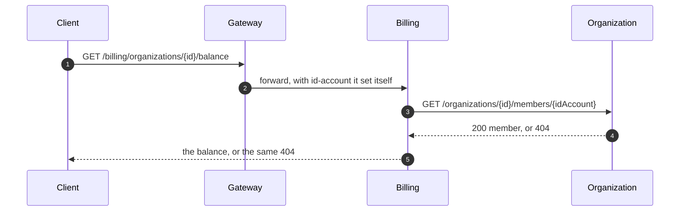

# Tenancy

Carmonai's unit of tenancy is the **organization**, not the account. An organization owns the API keys, the
tier, the credit and the usage; an account is a person who may be a member of several. This page is about what
keeps one organization out of another's data — and where that separation stops.

<figure class="cmn-figure">

<svg viewBox="0 0 760 280" role="img" aria-labelledby="dten-title" aria-describedby="dten-desc"
     xmlns="http://www.w3.org/2000/svg">
  <title id="dten-title">Two organizations through one request path, and where they are separated</title>
  <desc id="dten-desc">Two organizations each send a request with their own API key to the gateway, which
  strips any identity header the client sent and sets its own before forwarding to the inference service.
  Inference takes a token from that organization's own rate buckets and calls the engine with cache_salt set
  to the organization's id, so each tenant has its own prefix cache. The engine and its KV cache are shared
  by both.</desc>

  <defs>
    <marker id="dten-arrow" viewBox="0 0 10 10" refX="9" refY="5"
            markerWidth="6" markerHeight="6" orient="auto-start-reverse">
      <path class="cmn-arrow" d="M0 0 L10 5 L0 10 z"/>
    </marker>
  </defs>

  <!-- Hops in reading order: 1-2 the two callers, 3-4 the request inward, 5 the per-tenant bucket read. -->
  <g id="dten-hops">
    <path id="dten-hop1" class="cmn-link cmn-link--flow cmn-dash"
          d="M166 98 H180" marker-end="url(#dten-arrow)"/>
    <path id="dten-hop2" class="cmn-link cmn-link--flow cmn-dash"
          d="M166 182 H173 V136 H180" marker-end="url(#dten-arrow)"/>
    <path id="dten-hop3" class="cmn-link cmn-link--flow cmn-dash"
          d="M310 126 H360" marker-end="url(#dten-arrow)"/>
    <path id="dten-hop4" class="cmn-link cmn-link--flow cmn-dash"
          d="M500 126 H550" marker-end="url(#dten-arrow)"/>
    <path id="dten-hop5" class="cmn-link cmn-link--flow"
          d="M400 156 V200" marker-end="url(#dten-arrow)"/>
  </g>

  <g class="cmn-node cmn-node--entry cmn-node--soft" id="dten-orga" aria-labelledby="dten-orga-label">
    <rect x="16" y="76" width="150" height="44" rx="10"/>
    <text id="dten-orga-label" x="91" y="92">Org A</text>
    <text class="cmn-sub" x="91" y="108">key cmn_…</text>
  </g>

  <g class="cmn-node cmn-node--soft" id="dten-orgb" aria-labelledby="dten-orgb-label">
    <rect x="16" y="160" width="150" height="44" rx="10"/>
    <text id="dten-orgb-label" x="91" y="176">Org B</text>
    <text class="cmn-sub" x="91" y="192">key cmn_…</text>
  </g>

  <g class="cmn-node cmn-node--flow" id="dten-gateway" aria-labelledby="dten-gateway-label">
    <rect x="180" y="96" width="130" height="60" rx="10"/>
    <text id="dten-gateway-label" x="245" y="116">Gateway</text>
    <text class="cmn-sub" x="245" y="134">strips, then sets</text>
  </g>

  <g class="cmn-node cmn-node--flow" id="dten-inference" aria-labelledby="dten-inference-label">
    <rect x="360" y="96" width="140" height="60" rx="10"/>
    <text id="dten-inference-label" x="430" y="116">Inference</text>
    <text class="cmn-sub" x="430" y="134">buckets, caps, salt</text>
  </g>

  <g class="cmn-node cmn-node--accent" id="dten-engine" aria-labelledby="dten-engine-label">
    <rect x="550" y="96" width="190" height="60" rx="10"/>
    <text id="dten-engine-label" x="645" y="116">Engine</text>
    <text class="cmn-sub" x="645" y="134">one KV cache, shared</text>
  </g>

  <g class="cmn-node cmn-node--flow" id="dten-buckets" aria-labelledby="dten-buckets-label">
    <rect x="300" y="200" width="150" height="56" rx="10"/>
    <text id="dten-buckets-label" x="375" y="220">Rate buckets</text>
    <text class="cmn-sub" x="375" y="238">rl:{org}:{model}</text>
  </g>

  <circle class="cmn-packet cmn-travel" r="5"
          style="offset-path: path('M166 98 H180'); --cmn-travel: 0.7s; --cmn-delay: 0s;"></circle>
  <circle class="cmn-packet cmn-travel" r="5"
          style="offset-path: path('M166 182 H173 V136 H180'); --cmn-travel: 1s; --cmn-delay: 0.25s;"></circle>
  <circle class="cmn-packet cmn-travel" r="5"
          style="offset-path: path('M310 126 H360'); --cmn-travel: 0.7s; --cmn-delay: 0.6s;"></circle>
  <circle class="cmn-packet cmn-travel" r="5"
          style="offset-path: path('M500 126 H550'); --cmn-travel: 0.7s; --cmn-delay: 0.8s;"></circle>
  <circle class="cmn-packet cmn-travel" r="4.5"
          style="offset-path: path('M400 156 V200'); --cmn-travel: 0.7s; --cmn-delay: 1s;"></circle>

  <rect class="cmn-label-plate" x="188" y="76" width="52" height="16" rx="4"/>
  <text class="cmn-label" x="214" y="88">key A</text>
  <rect class="cmn-label-plate" x="104" y="140" width="52" height="16" rx="4"/>
  <text class="cmn-label" x="130" y="152">key B</text>
  <rect class="cmn-label-plate" x="316" y="158" width="70" height="16" rx="4"/>
  <text class="cmn-label" x="351" y="170">buckets</text>
  <rect class="cmn-label-plate" x="508" y="104" width="76" height="16" rx="4"/>
  <text class="cmn-label" x="546" y="116">cache_salt</text>
</svg>

<figcaption>Steps 1 and 2 bring two organizations' API keys to the only public port. Step 3 is the gateway
throwing away every identity header the clients sent and writing its own; step 4 is inference reading them and
nothing else. Step 5 is one of the two per-tenant enforcement points a request passes — a rate bucket keyed by
organization and model; the other is the `cache_salt` on the way to the engine. What is not separated is the
engine, its KV cache and the single database behind it.</figcaption>
</figure>

  <i class="is-flow"></i> a request travelling, or a check it passes (solid)
  <i class="is-accent"></i> the shared engine (teal outline)

1. **Two clients send API keys** for two different organizations — `Authorization: Bearer cmn_…`.
2. **The gateway resolves each key** through `apikey:{sha256}` in Valkey, and gets back the key id, organization
   id, organization status and tier.
3. **`IdentityHeadersFilter` strips `id-account`, `id-organization`, `id-api-key`, `tier` and `batch-line`**
   from the incoming request, then sets them from the principal it authenticated. A client cannot forge them,
   because its copies are removed before its own are written.
4. **Inference reads those headers and nothing else.** Missing or malformed headers are a **401**
   `invalid_api_key` — a request that did not come through the gateway is refused rather than served.
5. **The rate buckets are keyed by organization and model**: `rl:{org}:{model}:requests|input|output`. One Lua
   script refills and takes from all three atomically, with Valkey's own clock, so two organizations never
   share a budget and two replicas never multiply one.
6. **`cache_salt` is set to the organization id** on the way to vLLM, so each tenant gets its own prefix cache
   and cannot infer another's prompt by timing a request that shares its prefix.
7. **What is shared stays shared**: one PostgreSQL database with six schemas, one Valkey, and one engine whose
   KV cache holds both tenants' conversations at once.

## What it is

An organization is the tenant: it owns its API keys, its tier, its balance and its usage rows. An account is a
person, and a person reaches an organization's data only through a `membership` row. Every id the platform uses
to separate tenants is an organization id, and every place that separation is enforced reads one.

## The identity headers services trust

| Header | Set from | Read by |
|---|---|---|
| `id-account` | the JWT subject, on console routes | account-service, and every membership check |
| `id-organization` | the API key's organization, on `/v1` routes | inference-service, batch-service |
| `id-api-key` | the API key's id | inference-service, batch-service |
| `tier` | the organization's tier, from the key lookup | inference-service, batch-service |

Plus one internal marker, `batch-line: {batchId} {line} {batchCreatedAt}`, which batch-service adds when it
runs a line of a batch. It carries the batch's identity and its creation instant so a re-run produces the same
usage event — and the gateway strips it like the rest, or a client could buy answers at batch prices.

`IdentityHeadersFilter` strips a longer list than it sets: the four identity headers, `batch-line`, `cookie`
except on the two session endpoints, `forwarded`, every `x-forwarded-*`, and `traceparent`, `tracestate` and
`baggage`. The smoke test asserts the outcome — a request carrying `id-organization: 00000000-…` and
`tier: enterprise` gets the caller's own tier, and `batch-line: forged` never reaches inference-service.

Services trust these headers completely. That is the design, and it has a matching limit: anything that can
reach `inference:8080` inside the compose network can claim any tenant by sending them. The network is the
trust boundary, which is why nothing but the gateway is published.

## Membership is checked through organization-service

The `/v1` path never asks who a person is — an API key *is* the authorization. The customer-facing console
endpoints in usage-service and billing-service are different: they take an organization id in the path and an
`id-account` header, and they ask organization-service whether that account is a member.

1. The client calls the gateway with a JWT, and the gateway sets `id-account` from the token's subject.
2. `BillingService.balance` refuses a request with no `id-account` at all: **401**.
3. It calls organization-service's `member(id, idAccount)` before reading anything.
4. A non-member gets back the **404** organization-service gave — the same answer as for an organization that
   does not exist, so the endpoint never confirms that another tenant is real.
5. Only a member sees a number, and only for the organization in the path. There is no "my balance" by ambient
   identity and no list endpoint. `usage-service`'s summary follows the same rule.

The check is a Feign call per request, not a cache, and the `/v1` path never makes it.

## cache_salt: one tenant cannot time another's prefix cache

vLLM caches the KV blocks of a prompt prefix and reuses them when a later request starts with the same tokens.
That is a large win for a customer sending the same system prompt repeatedly — and a side channel, because a
request that hits the cache returns its first token measurably sooner. Without a salt, tenant B could learn
whether tenant A had recently sent a given prefix, one request at a time.

`ChatRequest.upstream()` sets `cache_salt` to `caller.organizationId()` for every vLLM model, next to the
tier's `priority`. Neither field is in the request's field allowlist, so a client cannot set either; both are
written into a fresh upstream object built from the allowlisted fields. The salt is the organization id, not a
secret — it does not need to be one, because its job is to partition the cache, and the organization id is
already the partition key the rest of the platform uses.

## Per-organization rate buckets

`Admission` builds the keys as `"rl:{" + caller.organizationId() + ":" + chat.model().id() + "}:"` followed by
`requests`, `input` and `output`. The braces are a Valkey Cluster hash tag: all three keys of one organization
and model land in the same hash slot, which is what lets a single Lua script touch all three. The script reads
time from Valkey rather than from the service, so replicas with drifting clocks still agree on when a token
comes back.

Inside one tier, the per-organization in-flight cap (`max-in-flight`: trial 2, standard 4, enterprise 16) is
what stops one organization filling its tier's share of the engine. Ordering between *waiting* organizations is
the virtual token counter — the organization with the lowest tokens served-plus-reserved goes first. That is
fairness, not isolation: no organization can be starved and none can monopolise, but two organizations on the
same tier have exactly the same rights.

## What isolation does not exist yet

- **One database.** Six schemas, one PostgreSQL instance, one application role. Isolation between tenants is
  `WHERE organization_id = ?` in the read paths plus the membership checks above — no row-level security policy
  and no per-tenant role.
- **One engine.** vLLM serves both organizations from one KV cache and one queue. `cache_salt` partitions the
  prefix cache; priority and the tier caps decide who runs first. Neither is a hard boundary.
- **One Valkey.** Buckets, flags and the usage stream are keyed by organization, but a single instance holds
  them, with no per-tenant database or ACL.
- **The network is the trust boundary.** `id-organization` is trusted because only the gateway is reachable
  from outside. A shared network or a second published port makes the headers forgeable.
- **A revoked key reaches the gateway within 60 s.** Revocation deletes the `apikey:{sha256}` entry, and a
  closed or suspended organization is refused within the lookup's cache TTL. Bounded and named, not zero.
- **Batch lines keep the batch's identity**, not the caller's, so a key revoked after a batch was created does
  not stop it. Only credit is checked per line, in `Admission`.

## Why it is like this

**The organization as the unit, not the account.** A person can leave a company and a company can outlive the
people in it. Usage, credit and API keys belong to the thing that pays, which is why `organization_id` and not
`account_id` is the column every metering row carries.

**Headers, not a lookup per hop.** The alternative is every service calling organization-service on every
request, which puts a synchronous dependency in the middle of the streaming path. The gateway resolving
identity once is the same choice that keeps the JWKS check local.

**Membership checked in the service, not the gateway.** The gateway would have to know which routes take an
organization id and what "member" means; the service that owns the read knows both. The cost is one Feign call
per console request, and console requests do not touch the GPU.

## What would change it

- **A second database or a shared one.** Row-level security policies per organization, or a database per
  tenant, is the upgrade path once hosting is decided.
- **A second inference-service replica.** The in-flight caps and virtual token counters live in one JVM, so two
  replicas would each admit up to the tier cap. Shared counters come first.
- **Any new route that takes an organization id and does not check membership.** `usage-service` and
  `billing-service` both do; nothing framework-level enforces it — only the pattern and the tests.
- **A network between services that is not trusted.** mTLS or signed identity headers replace "the network is
  trusted". Neither exists today, and neither is needed while nothing but the gateway is published.

## Where to look

- [IdentityHeadersFilter.java](https://github.com/carmonai/back/blob/main/api/gateway-service/src/main/java/ai/carmonai/gateway/IdentityHeadersFilter.java)
  — the exact strip list and what is set in its place.
- [ChatRequest.java](https://github.com/carmonai/back/blob/main/api/inference-service/src/main/java/ai/carmonai/inference/ChatRequest.java)
  — the field allowlist, `cache_salt` and the tier priority.
- [Admission.java](https://github.com/carmonai/back/blob/main/api/inference-service/src/main/java/ai/carmonai/inference/Admission.java)
  — the per-organization bucket keys, the per-organization cap and the VTC ordering.
- [BillingService.java](https://github.com/carmonai/back/blob/main/api/billing-service/src/main/java/ai/carmonai/billing/BillingService.java)
  — the membership check and the 401/404 rule, in `balance()`.
