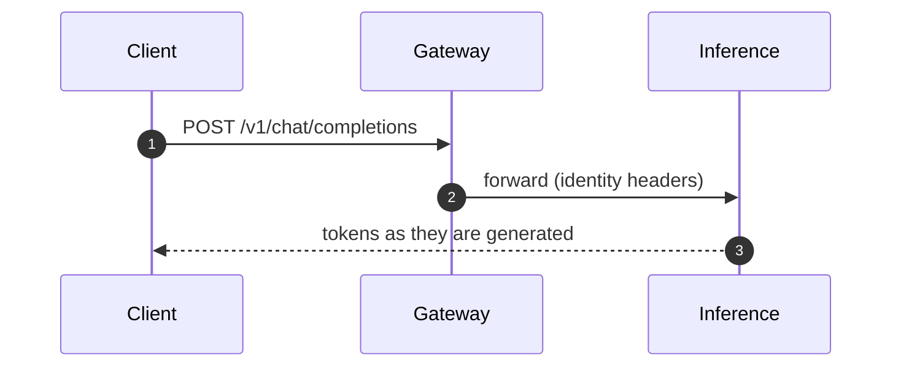

# Visual spec — how to draw a diagram for this site

This is the operational half of `work/research/visual-design-rules.md` (906 lines, every rule sourced). Read
that file if you want the reasoning or the WCAG clause behind a rule. **This file is what you follow.** The
30-rule card there is the normative version; the numbers below are the same numbers.

Two labels, used the same way as in the research file:

- **[R] requirement** — from WCAG 2.2 or a spec. Do not adapt. A diagram that breaks one is not shippable.
- **[T] taste** — house style. Change it in `docs/stylesheets/`, once, never per diagram.

---

## 1. What a diagram is for

**[T] Animate only to show order and position** — which hop happens when, where the payload is. If a static
frame already shows the order, ship the static frame. A diagram that moves for decoration is worse than one
that does not move, because it costs attention and says nothing.

Every page carries **one hero diagram** (hand-authored animated SVG) and, only where it genuinely helps, one
Mermaid diagram for sequence or state.

## 2. The canvas

| Property | Value |
|---|---|
| `<svg viewBox>` | start from **`0 0 760 280`** — a **2.7:1** canvas, which survives the narrow column |
| `width` / `height` | **neither** — `diagrams.css` sets `width: 100%; height: auto` |
| Stroke widths | from the classes. If you must inline one: connector **2px**, node outline **1.5px** — units are mandatory (`2` alone is not valid SVG) |
| Corner radius | `rx="10"` on a node rect |
| Node label | 13px, weight 600, `text-anchor: middle` |
| Sub-label under it | 11px, weight 400, class `cmn-sub` |
| Edge label | 11px, weight 500, class `cmn-label`, on a `cmn-label-plate` if it sits near a stroke |
| Reading direction | **left to right** for a request/response round trip; **top to bottom** for a pipeline |

Keep the whole diagram inside the viewBox — `overflow: visible` is set, but a diagram that bleeds outside it
looks broken rather than intentional.

## 3. Colour: never write one

**[R]** Do not write a hex value in the SVG. Use the classes; they resolve through `tokens.css`, which
declares every colour twice — once for `[data-md-color-scheme="default"]` and once for `"slate"`.

> **[R] The trap this avoids.** Material's dark palette is not a bare `prefers-color-scheme` media query: the
> theme wraps it in `[data-md-color-scheme="slate"]` and its own toggle sets that attribute from JavaScript.
> A diagram authored against `@media (prefers-color-scheme: dark)` renders dark colours on a light page the
> moment a reader uses the site toggle. Author against the attribute — which is what using the classes does.

**[R] Colour never carries meaning on its own.** Pair it with a second channel, and make the pairing
consistent everywhere:

| Meaning | Class | Channel besides colour |
|---|---|---|
| a request travelling | `cmn-link--flow` | solid line |
| a response coming back | `cmn-link--accent` | **dashed** line |
| money moving | `cmn-link--money` | **dashed** line, different hue |
| an asynchronous hop | `cmn-link--quiet` | **dotted** line |
| an error path | `cmn-node--danger` | label says what failed |

**[R]** Every colour-coded meaning also appears **in words** — in the caption, the legend or the numbered
walkthrough. The `.cmn-legend` block exists for exactly that; keep it.

## 4. Copy this template

Accessible markup, correct units, motion that respects `prefers-reduced-motion`. Replace the content, keep
the structure.

```html
<figure class="cmn-figure">
<div class="cmn-flow" markdown="0">
<svg viewBox="0 0 760 280" role="img" aria-labelledby="fig-id-title" aria-describedby="fig-id-desc"
     xmlns="http://www.w3.org/2000/svg">
  <title id="fig-id-title">Short name of the flow</title>
  <desc id="fig-id-desc">One or two sentences: what enters, what leaves, and in what order.</desc>

  <!-- arrowheads: colour follows the line through context-stroke -->
  <defs>
    <marker id="fig-id-arrow" viewBox="0 0 10 10" refX="9" refY="5"
            markerWidth="6" markerHeight="6" orient="auto-start-reverse">
      <path class="cmn-arrow" d="M0 0 L10 5 L0 10 z"/>
    </marker>
  </defs>

  <!-- 1. connectors first, so nodes sit on top of them.
       DOM order is reading order (rule 17): the first path is hop 1. -->
  <g id="fig-id-hops">
    <path id="fig-id-hop1" class="cmn-link cmn-link--flow cmn-dash"
          d="M150 120 H330" marker-end="url(#fig-id-arrow)"/>
    <path id="fig-id-hop2" class="cmn-link cmn-link--accent cmn-dash"
          d="M470 120 H650" marker-end="url(#fig-id-arrow)"/>
  </g>

  <!-- 2. nodes. Give each group an id and wire aria-labelledby to its own text
       so the accessible name cannot drift from the visible label (rule 25). -->
  <g class="cmn-node cmn-node--entry cmn-node--flow" id="fig-id-client"
     aria-labelledby="fig-id-client-label">
    <rect x="30" y="92" width="120" height="56" rx="10"/>
    <text id="fig-id-client-label" x="90" y="112">Client</text>
    <text class="cmn-sub" x="90" y="130">SDK or app</text>
  </g>

  <g class="cmn-node cmn-node--flow" id="fig-id-gateway" aria-labelledby="fig-id-gateway-label">
    <rect x="330" y="92" width="140" height="56" rx="10"/>
    <text id="fig-id-gateway-label" x="400" y="112">Gateway</text>
    <text class="cmn-sub" x="400" y="130">the only public port</text>
  </g>

  <!-- 3. packets: one per hop, each on its own edge. `offset-path` carries the
       geometry; `--cmn-travel` and `--cmn-delay` tune the loop. -->
  <circle class="cmn-packet cmn-travel" r="5"
          style="offset-path: path('M150 120 H330'); --cmn-travel: 1.4s; --cmn-delay: 0s;"></circle>
  <circle class="cmn-packet cmn-packet--accent cmn-travel" r="5"
          style="offset-path: path('M470 120 H650'); --cmn-travel: 1.4s; --cmn-delay: 0.7s;"></circle>

  <!-- 4. labels last: they must sit above everything, on their own plate. -->
  <text class="cmn-label" x="240" y="100">API key + request</text>
  <text class="cmn-label" x="560" y="100">streamed tokens</text>
</svg>
</div>
<figcaption>Hop 1 carries the API key to the gateway; hop 2 brings the answer back. The gateway is the only
service reachable from outside.</figcaption>
</figure>

<div class="cmn-legend">
  <span><i class="is-flow"></i> a request travelling (solid)</span>
  <span><i class="is-accent"></i> a response (dashed)</span>
</div>
```

Then, **immediately after the figure**, write the numbered walkthrough — one line per step. **[R]** That
walkthrough is the long text alternative WCAG requires for an animated diagram (SC 1.1.1 situation B), and
the animation is a rendering *of* it, not a replacement for it:

```markdown
1. The client sends the API key and the request body to the gateway.
2. The gateway resolves the key, checks the organization's credit flag, and forwards the request
   downstream with identity headers the client never sees.
```

## 5. Class reference

| Class | Use for |
|---|---|
| `cmn-flow` | the wrapper `<div>`. Always present. |
| `cmn-node` | a node group. `cmn-node--flow` / `--accent` / `--money` / `--soft` / `--danger` change the outline. |
| `cmn-node--entry` | the node a reader should start from. Heavier outline. |
| `cmn-link` | a connector path. Add one modifier: `--flow`, `--accent`, `--money`, `--quiet`. |
| `cmn-dash` | makes a dashed connector's dashes travel. Add to any `cmn-link`. |
| `cmn-packet` | the moving circle. `--accent` / `--money` recolour it. |
| `cmn-travel` | the motion itself. Needs an inline `offset-path`. |
| `cmn-step` | a node that lights up in its turn. Stagger with `--i` and a delay. |
| `cmn-draw` | a path that draws itself on. |
| `cmn-pulse` | a soft halo for attention, no movement. |
| `cmn-sub` | the small second line inside a node. |
| `cmn-label` | a label outside a node. |
| `cmn-label-plate` | a backing rect so a label never sits on a stroke. |
| `cmn-legend` | the legend row under the figure. |
| `cmn-figure` | the `<figure>` wrapper, for the caption spacing. |

## 6. Mermaid

Use Mermaid for **sequence and state**, never for the hero diagram — and never for anything that must move.

Four findings that decide how you write these, all verified against the code Material actually runs:

1. **Material renders Mermaid into a *closed* shadow root.** Its own source calls
   `host.attachShadow({ mode: "closed" })` and injects the SVG there. The consequences are absolute:
   `extra_css` **cannot** style `.mermaid svg`, `.node` or `.edgePath`; our scripts **cannot** reach it
   (`shadowRoot` is null); and no animation library can drive it. Supplying our own `window.mermaid` does not
   help, because the `attachShadow` call is Material's, not Mermaid's.
   **So: a diagram that animates is hand-authored SVG. Full stop.**
2. **Load nothing.** Material's bundle fetches `https://unpkg.com/mermaid@11/dist/mermaid.min.js` itself and
   initialises it with its own `themeCSS`. Do **not** add the library, do **not** add an init script, and do
   **not** write a `%%{init}%%` block — a second `initialize()` only fights the theme.
3. Light and dark work with no effort: Material never sets Mermaid's `theme` (so `default` applies) and its
   injected `themeCSS` is written against Material's custom properties, which flip with the palette.
4. **[R] The reduced-motion problem.** Mermaid can animate its own flow edges (`e1@{ animate: true }`), and
   because of the closed shadow root **we cannot switch that off** for a reader who asks for reduced motion.
   So we do not use animated Mermaid edges at all: motion lives only in our own SVG, where `flow.css` already
   honours `prefers-reduced-motion`. A Mermaid diagram on this site is static by policy, not by accident.

````markdown

````

**[R]** A Mermaid diagram still counts as a figure: give it an introducing sentence and a numbered
walkthrough in the prose, and keep its labels short.

## 7. Motion budget

| [T] rule | Value |
|---|---|
| one hop travelling a connector | 200–350 ms |
| one full request → response trip | 1.2–2.4 s |
| stagger between steps | 90–140 ms, max 8 steps, total ≤ 2.5 s |
| easing entering a node | `ease-out` |
| easing across a link | `linear` |
| **[R] whole autonomous sequence** | **under 5 s, or it needs a visible stop control** |

**[R]** The static state is the default and all motion lives inside
`@media (prefers-reduced-motion: no-preference)` — which `flow.css` already does. Your job is to make sure
the **static** frame still tells the story: the packet at rest sits at the **end** of its hop (already set),
so a reader with reduced motion sees arrival, not nothing.

## 8. Accessibility checklist — every diagram

- [ ] **[R]** `role="img"` plus `aria-labelledby` and `aria-describedby` on the `<svg>`.
- [ ] **[R]** `<title id="…">` is the **first child**; `<desc id="…">` gives the one-sentence summary.
- [ ] **[R]** Decoration carries `aria-hidden="true"` — grid lines, glows, backgrounds.
- [ ] **[R]** DOM order is reading order: hop 1's path comes before hop 2's.
- [ ] **[R]** Text is live `<text>`, never outlines, never an image.
- [ ] **[R]** A numbered prose walkthrough follows the figure.
- [ ] **[R]** Labels are ≤ 5 words, ≤ 2 lines; a longer idea belongs in the caption.
- [ ] **[T]** Every node has a unique `id` and its own `aria-labelledby`.

## 9. Never ship

**[R]** colour-only legends; gradients that carry meaning; animation over 5 s with no stop control; motion
with no reduced-motion path; hairlines used as structure; unlabelled data; text baked into pixels.

**[T]** 3D, bevel or gloss on nodes; drop shadows as hierarchy; a node shape that means one thing on one page
and another on the next; parallax; a diagram that invents its own geometry.

## 10. Checking your work

The palette's contrast was computed, and you can recompute it:

```bash
node work/research/contrast-check.mjs
```

Every pair it prints must pass. If you introduce a colour, add it to `tokens.css` for **both** schemes and
check it there.
