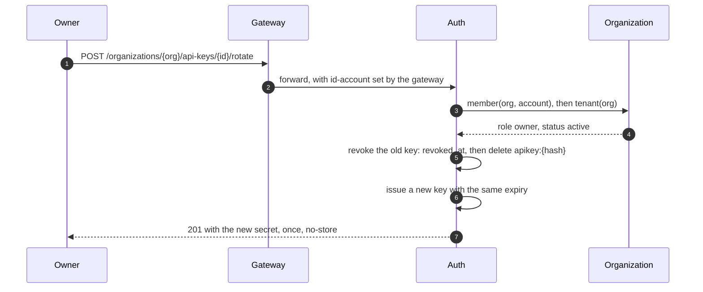

# Auth

## What it is

`auth-service` owns the `auth` schema and answers exactly one question: who is this? It turns an email and a
password into a console session, issues the RS256 access token the gateway verifies, publishes the JWKS that
verification uses, and stores API keys in a form that is useless to whoever steals the database.

<figure class="cmn-figure">

<svg viewBox="0 0 760 280" role="img" aria-labelledby="auth-title" aria-describedby="auth-desc"
     xmlns="http://www.w3.org/2000/svg">
  <title id="auth-title">A console session: issued, rotated, and ended when a copy is reused</title>
  <desc id="auth-desc">A browser logs in and receives an access token plus a refresh cookie whose secret is
  stored only as a SHA-256 hash. Each refresh rotates the secret; when a copy of an older secret comes back,
  the reuse is detected and every copy of the session is ended.</desc>
  <defs>
    <marker id="auth-arrow-flow" viewBox="0 0 10 10" refX="9" refY="5" markerWidth="6" markerHeight="6" orient="auto-start-reverse"><path class="cmn-arrow" d="M0 0 L10 5 L0 10 z"/></marker>
    <marker id="auth-arrow-accent" viewBox="0 0 10 10" refX="9" refY="5" markerWidth="6" markerHeight="6" orient="auto-start-reverse"><path class="cmn-arrow" d="M0 0 L10 5 L0 10 z"/></marker>
  </defs>
  <!-- Hops in reading order: login, the token and the row, the rotation, the copy that returns, the end. -->
  <g id="auth-hops">
    <path id="auth-hop1" class="cmn-link cmn-link--flow cmn-dash" d="M130 68 H178" marker-end="url(#auth-arrow-flow)"/>
    <path id="auth-hop2" class="cmn-link cmn-link--flow cmn-dash" d="M328 68 H376" marker-end="url(#auth-arrow-flow)"/>
    <path id="auth-hop3" class="cmn-link cmn-link--flow cmn-dash" d="M526 68 H574" marker-end="url(#auth-arrow-flow)"/>
    <path id="auth-hop4" class="cmn-link cmn-link--flow cmn-dash" d="M253 96 V176" marker-end="url(#auth-arrow-flow)"/>
    <path id="auth-hop5" class="cmn-link cmn-link--flow cmn-dash" d="M130 252 H451 V232" marker-end="url(#auth-arrow-flow)"/>
    <path id="auth-hop6" class="cmn-link cmn-link--accent cmn-dash" d="M526 204 H574" marker-end="url(#auth-arrow-accent)"/>
  </g>
  <g class="cmn-node cmn-node--entry cmn-node--soft" id="auth-browser" aria-labelledby="auth-browser-label"><rect x="20" y="40" width="110" height="56" rx="10"/><text id="auth-browser-label" x="75" y="60">Browser</text><text class="cmn-sub" x="75" y="78">console session</text></g>
  <g class="cmn-node cmn-node--flow" id="auth-login" aria-labelledby="auth-login-label"><rect x="178" y="40" width="150" height="56" rx="10"/><text id="auth-login-label" x="253" y="60">Login</text><text class="cmn-sub" x="253" y="78">token + cookie</text></g>
  <g class="cmn-node cmn-node--flow" id="auth-session" aria-labelledby="auth-session-label"><rect x="376" y="40" width="150" height="56" rx="10"/><text id="auth-session-label" x="451" y="60">Session row</text><text class="cmn-sub" x="451" y="78">SHA-256 of the secret</text></g>
  <g class="cmn-node cmn-node--flow" id="auth-token" aria-labelledby="auth-token-label"><rect x="574" y="40" width="166" height="56" rx="10"/><text id="auth-token-label" x="657" y="60">Access token</text><text class="cmn-sub" x="657" y="78">RS256, 15 minutes</text></g>
  <g class="cmn-node cmn-node--flow" id="auth-refresh" aria-labelledby="auth-refresh-label"><rect x="178" y="176" width="150" height="56" rx="10"/><text id="auth-refresh-label" x="253" y="196">Refresh</text><text class="cmn-sub" x="253" y="214">rotates the secret</text></g>
  <g class="cmn-node cmn-node--danger" id="auth-reuse" aria-labelledby="auth-reuse-label"><rect x="376" y="176" width="150" height="56" rx="10"/><text id="auth-reuse-label" x="451" y="196">Reuse</text><text class="cmn-sub" x="451" y="214">secret used twice</text></g>
  <g class="cmn-node cmn-node--soft" id="auth-ended" aria-labelledby="auth-ended-label"><rect x="574" y="176" width="166" height="56" rx="10"/><text id="auth-ended-label" x="657" y="196">Session ended</text><text class="cmn-sub" x="657" y="214">every copy is dead</text></g>
  <g class="cmn-node cmn-node--soft" id="auth-copy" aria-labelledby="auth-copy-label"><rect x="20" y="228" width="110" height="48" rx="10"/><text id="auth-copy-label" x="75" y="245">Old copy</text><text class="cmn-sub" x="75" y="261">the same cookie</text></g>
  <circle class="cmn-packet cmn-travel" r="5" style="offset-path: path('M130 68 H178'); --cmn-travel: 1s; --cmn-delay: 0s;"></circle>
  <circle class="cmn-packet cmn-travel" r="5" style="offset-path: path('M328 68 H376'); --cmn-travel: 1s; --cmn-delay: 0.2s;"></circle>
  <circle class="cmn-packet cmn-travel" r="5" style="offset-path: path('M526 68 H574'); --cmn-travel: 1s; --cmn-delay: 0.4s;"></circle>
  <circle class="cmn-packet cmn-travel" r="5" style="offset-path: path('M253 96 V176'); --cmn-travel: 1.1s; --cmn-delay: 0.65s;"></circle>
  <circle class="cmn-packet cmn-travel" r="5" style="offset-path: path('M130 252 H451 V232'); --cmn-travel: 1.5s; --cmn-delay: 0.95s;"></circle>
  <circle class="cmn-packet cmn-packet--accent cmn-travel" r="4.5" style="offset-path: path('M526 204 H574'); --cmn-travel: 1s; --cmn-delay: 1.35s;"></circle>
  <rect class="cmn-label-plate" x="134" y="46" width="40" height="16" rx="4"/><text class="cmn-label" x="154" y="58">login</text>
  <rect class="cmn-label-plate" x="329" y="46" width="46" height="16" rx="4"/><text class="cmn-label" x="352" y="58">issues</text>
  <rect class="cmn-label-plate" x="527" y="46" width="46" height="16" rx="4"/><text class="cmn-label" x="550" y="58">token</text>
  <rect class="cmn-label-plate" x="259" y="120" width="46" height="16" rx="4"/><text class="cmn-label" x="282" y="132">refresh</text>
  <rect class="cmn-label-plate" x="228" y="256" width="124" height="16" rx="4"/><text class="cmn-label" x="290" y="268">an old copy returns</text>
</svg>

<figcaption>The browser logs in and gets two things: an access token it sends as a bearer header, and a refresh
cookie whose secret exists in the database only as a hash. Every refresh replaces that secret. When a secret
that is no longer current arrives — which means the cookie was copied — the session ends for whoever holds
it.</figcaption>
</figure>

  <i class="is-flow"></i> a request travelling (solid)
  <i class="is-accent"></i> the answer that ends the session (dashed)

1. **The browser posts credentials to `POST /auth/login`.** The password check is not this service's: it is
   account-service's `POST /accounts/login`, and auth-service turns the resulting account id into a session.
2. **A session row is written.** The cookie's value is `{session id}.{secret}`; the row holds the id, the
   account, and `token_hash` — the SHA-256 of the secret, never the secret.
3. **An RS256 access token comes back in the body**, valid for 15 minutes, next to a `Set-Cookie` carrying
   the refresh cookie. The response is `Cache-Control: no-store`.
4. **The browser refreshes.** `POST /auth/refresh` presents the cookie; the service issues a new secret,
   replaces `token_hash` in the row, and answers with a new access token and a new cookie.
5. **A copy of the previous secret arrives later.** The hash no longer matches the row, so this is the only
   signal the platform gets that the cookie was duplicated.
6. **Every copy ends.** The row is deleted, so the thief's copy and the honest one are both dead, and the
   answer is 401 with an already-expired cookie.

## The access token

`JwtService` signs with RS256 using a key built from `carmonai.jwt.private-key` (base64 PKCS#8 DER); the
public half is derived from the private key and the key id is the JWK thumbprint. The claims are `iss`
(`ai.carmonai`), `sub` (the account id), `iat` and `exp` — and nothing else. No name, no email, no roles: the
token is a bearer credential that travels through a browser, so it carries identifiers only.

The 15-minute lifetime is a constant in the class, not a configuration key, and it is what makes the rotation
story work: the refresh cookie is the long-lived thing, and it is opaque, rotating and revocable.

`GET /auth/jwks` publishes the public key. The gateway builds a `NimbusReactiveJwtDecoder` from
`carmonai.jwt.jwks-uri` (default `http://auth:8080/auth/jwks`), pins the issuer to `ai.carmonai`, and caches
the key set — so a token is verified locally and no request path calls auth-service. The property exists so an
integration test can point the decoder at a stub.

## The refresh cookie

The name is `__Host-carmonai-rt`, and the prefix is load-bearing: `__Host-` cookies are only accepted with
`Secure`, `Path=/` and no `Domain`, so no subdomain can set or overwrite it. The attributes are `HttpOnly`,
`Secure`, `SameSite=Strict`, `Path=/`. `Max-Age` is 30 days at login, the remaining lifetime on each refresh,
and zero on logout or a rejected refresh.

Behind it, `session(id, account_id, token_hash, created_at, last_used_at, expires_at)`. The secret is 32
random bytes, base64url-encoded, and only its SHA-256 is stored — a database dump does not yield a usable
cookie. Two limits apply, and they answer different questions: **idle 7 days** (`last_used_at + IDLE`, so a
session nobody uses stops working) and **absolute 30 days** (`expires_at`, so a session that is used
continuously still ends).

`SessionService.refresh` compares hashes with `MessageDigest.isEqual`, then rotates with a conditional
update: `sessions.rotate(id, currentHash, newHash, now)` returns the number of rows changed, so if two
refreshes race with the same cookie exactly one wins and the loser gets a 401 rather than a second live
secret. A nightly job at 03:23 deletes sessions past either limit.

Logout is deliberately narrow: `close()` deletes the session only if the presented cookie is the *current*
one, so a stale copy cannot end someone else's session. `DELETE /auth/sessions/accounts/{idAccount}` is the
blunt version, internal only, and it is called when the account is erased and when a password is reset.

## API keys

| Operation | Endpoint | Who | Answer |
|---|---|---|---|
| create | `POST /organizations/{organization}/api-keys` | owner, admin | 201, `Location`, the secret once |
| list | `GET /organizations/{organization}/api-keys` | any member | 200, paged (`size` capped at 100) |
| rotate | `POST /organizations/{organization}/api-keys/{id}/rotate` | owner, admin | 201, the new secret once |
| revoke | `DELETE /organizations/{organization}/api-keys/{id}` | owner, admin | 204 |
| resolve | `GET /api-keys/{hash}` | internal only | 200 with ids, status, tier, expiry |

The key format lives in `ApiKeys`: the prefix, 43 base62 characters (256 random bits), and a 6-character
base62 CRC32 of those 43. Only the SHA-256 is stored, in `secret_hash`, which is `UNIQUE` — and the last four
characters are kept as a `hint` so a customer can tell two keys apart in a list without either being
recoverable. The secret is returned exactly once, on create and on rotate, with `Cache-Control: no-store`.

The cap is `MAX_ACTIVE_KEYS = 50` per organization, counted with `countLiveByOrganizationId` — expired keys
are not live keys, they already fail the lookup, so they free their slot. Counting them would let a customer's
own expiries lock the organization at 50 with nothing left to revoke by hand.

`expires_at` is optional and `NULL` means never; a supplied value must be in the future. `create` refuses a
name outside 1–64 characters and refuses to issue a key for an organization whose `tenant(id).status()` is
not `active`.

Rotation is the operation worth reading. It is `@Transactional` and calls the full `create` path internally,
so rotation carries the same authorization, the same active-organization rule and the same cap as creation.
The new key **keeps the old key's expiry**, because rotating must not silently un-expire a key or grant a
fresh 90 days.

1. The gateway has already resolved the console session and sets `id-account` before forwarding.
2. auth-service asks organization-service for the caller's role, then for the organization's status.
3. The old key is revoked first: `revoked_at` is set and the gateway's `apikey:{hash}` entry is deleted.
4. The new key is issued through the same `create` path, keeping the old key's expiry.
5. The new secret is in that one response and nowhere else; the response is `no-store`.

Revoking deletes the gateway's cache entry directly (`apikey:{secretHash}`), which is why a revocation takes
effect immediately while an expiry can lag by up to the cache's 60-second TTL.

## Why it is like this

**Two credentials with two lifetimes.** A 15-minute bearer token cannot be revoked without a lookup on every
request, so it is made short enough that revocation does not matter. The long-lived credential is the one
that *is* revocable, and it never travels in a header a script can read.

**Reuse detection ends both copies, on purpose.** When a rotated secret comes back, the platform cannot tell
which holder is the thief. Ending the session is the only answer that is safe for the customer; the honest
user logs in again.

**SHA-256 for keys and session secrets, Argon2id only for passwords.** An API key and a session secret carry
256 random bits, so there is nothing to brute-force and a slow hash would only add latency to a request-path
lookup. A password is low-entropy and gets a memory-hard hash — in [Account](account.md).

**The Feign contract carries `Cookie` as a header.** Spring's `@CookieValue` is a server-side annotation and
there is no Feign equivalent, so `AuthController.refresh` and `logout` take
`@RequestHeader("Cookie") String`. The gateway passes that cookie through on those two paths and strips it
everywhere else.

**Keys belong to the organization, not the person who created them.** An employee leaving does not take the
integration with them, and the 50-key cap is a property of the tenant.

## What would change it

- **There is no maximum API key lifetime.** The API takes what the caller asks for and `NULL` means never. A
  policy such as 90 days belongs in the console, where it can be changed without moving the API.
- **One signing key.** Rotation means publishing the old and the new in the JWKS until every token signed
  with the old one has expired — which the 15-minute TTL makes cheap, and which is not implemented.
- **The 50-key cap is counted, then enforced.** Two concurrent creates can overshoot by one; locking the
  organization row is the fix if that ever matters.
- **An expiry is only as precise as the gateway's cache.** A key that expires while its `apikey:{hash}` entry
  is cached keeps working for the rest of that minute.
- **Password reset has a per-IP throttle and no per-email one**, so nothing stops many reset mails to one
  address from many addresses.

## Where to look

- [AuthController.java](https://github.com/carmonai/back/blob/main/api/auth/src/main/java/ai/carmonai/auth/AuthController.java) — the contract, including the two raw-cookie methods.
- [JwtService.java](https://github.com/carmonai/back/blob/main/api/auth-service/src/main/java/ai/carmonai/auth/JwtService.java) — RS256, the 15-minute TTL and the JWKS.
- [SessionService.java](https://github.com/carmonai/back/blob/main/api/auth-service/src/main/java/ai/carmonai/auth/SessionService.java) — the cookie, the rotation and the reuse check.
- [ApiKeyService.java](https://github.com/carmonai/back/blob/main/api/auth-service/src/main/java/ai/carmonai/auth/ApiKeyService.java) — the cap, the expiry rule and the transactional rotate.
- [ApiKeys.java](https://github.com/carmonai/back/blob/main/api/auth-service/src/main/java/ai/carmonai/auth/ApiKeys.java) — the key's shape, mirrored by the gateway.
